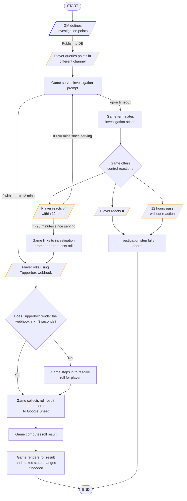

A lot of the architecture for this bot was written entirely as flowcharts. I have not written a flowchart since I was in elementary school, but I understand why many programmers swear by them.

# Auto-GM

I am a very busy person IRL, and while I can certainly make time to host live events on the evenings, there are cases where I want my players to do things without my supervision, but _not_ without my supervision, you know? I want them to be able to discover things while I'm away...

This is inspired by Ultimate Assitant's truth bullet mechanics, but is meant to work alongside the current roleplay meta (which is to use Tupperbox.) "Bullets" (investigate prompts) won't just appear during a murder case, they can appear even outside. All it takes is the right aliases to find them.

## Core objective

An asynchronous investigation system that handles prompt serving, player roll parsing (with proxy fallbacks), and automated state progression via Discord without requiring live GM oversight.

